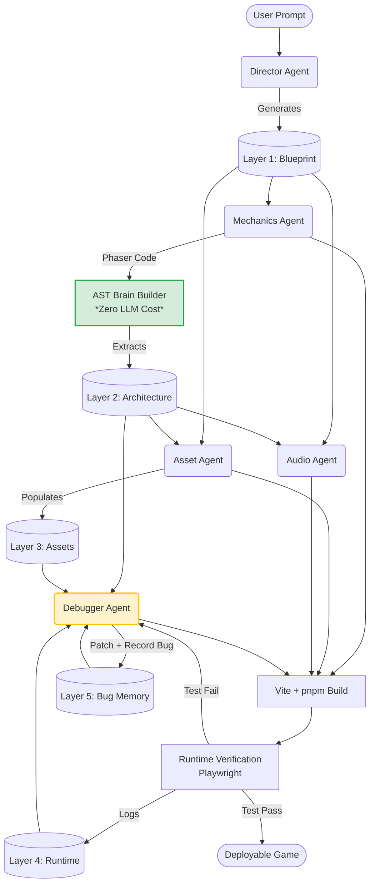

# VibeStudio AI: Comprehensive FinOps Cost & Risk Assessment (Project Brain Edition)

## Executive Summary

This report provides a formal cost estimation and risk audit for **VibeStudio AI**, an open-source multi-agent framework that generates 2D browser games. This assessment explicitly factors in the **Project Brain** architectural upgrade outlined in the feasibility document.

Assuming the use of the **DeepSeek V4 Flash** model via OpenRouter (with cache-enabled endpoints), the integration of the "Project Brain" drastically reduces token bloat. By utilizing a non-LLM AST "Brain Builder" and structured memory layers, we project a highly cost-efficient baseline of **~$0.0055 per generated game** in LLM costs—a **25% cost reduction** compared to the naive architecture.

Furthermore, the introduction of **Layer 5 (Bug Memory)** significantly mitigates the critical risk of infinite debugging loops. However, some infrastructure-level guardrails are still required.

**Key Recommendations:**
1. **Implement Hard Budget Limits:** Cap the Debugger Agent's retries to a maximum of 3 per game generation, despite the improved Bug Memory.
2. **Maximize Context Caching:** Cache the static Brain schemas and system prompts to reduce input costs by up to 50%.
3. **Isolate Worker Resources:** Prevent runaway playwright/browser instances from consuming infinite infrastructure compute by adding strict 30-second timeouts.

---

## 1. Architecture Understanding (Integrating Project Brain)

The system operates via a sequential and parallel pipeline orchestrated by Fastify and BullMQ. The crucial upgrade is the **Project Brain**, a central intelligence repository stored as JSON layers in a `.vibebrain/` directory.

### Agent Workflow Diagram

**Architectural Efficiencies:**
- **AST Brain Builder**: Uses static code analysis to map relationships instead of passing 10k tokens of source code into an LLM.
- **Targeted Context**: Agents only ingest the specific JSON layers they need, eliminating prompt duplication overhead.

---

## 2. Cost Drivers Analysis

### LLM Pricing Model (DeepSeek V4 Flash via OpenRouter)
*As of mid-2026 pricing estimates:*
- **Input Tokens:** $0.15 per 1M tokens ($0.00015 / 1k)
- **Cached Input Tokens:** $0.05 per 1M tokens ($0.00005 / 1k)
- **Output Tokens:** $0.30 per 1M tokens ($0.00030 / 1k)

### Token Volume Drivers (Dramatically Reduced)
- **Targeted JSON Schemas**: Replace raw file dumps. The Debugger Agent now reads a lightweight Architecture JSON (Layer 2) and Bug Memory (Layer 5) instead of brute-forcing thousands of lines of Phaser code.
- **System Prompts**: High, but easily cacheable.

### Infrastructure Costs
- **Worker Processes**: Playwright headless browser rendering and AST parsing. AST parsing is exceptionally cheap compared to LLM inference.
- **Queue/DB**: Minimal orchestration overhead.

---

## 3. Agent Execution Cost Breakdown

Token consumption is estimated per single game generation request, factoring in the Project Brain's targeted memory layers.

| Agent | Input Tokens (est.) | Output Tokens (est.) | Cost / Call (Uncached) | Notes |
|---|---|---|---|---|
| Director | 1,500 | 1,500 | $0.000675 | Generates L1 |
| Mechanics | 3,000 | 4,000 | $0.001650 | Reads L1 |
| Asset | 1,500 | 3,000 | $0.001125 | Reads L1 + L2 JSON |
| Audio | 1,500 | 2,000 | $0.000825 | Reads L1 + L2 JSON |
| Debugger | 4,000 | 2,000 | $0.001200 | Reads L2, L3, L5 JSON + Stack |

### 🟢 Best Case (0 Retries)
User Query -> Director -> 3 Agents -> Build -> Pass
- **Tokens:** 7,500 Input / 10,500 Output
- **LLM Cost:** **$0.00427**

### 🟡 Typical Case (1 Clarification, 1 Retry)
User Query -> Director (x2) -> 3 Agents -> Build -> Fail -> Debugger -> Pass
- **Tokens:** 13,000 Input / 14,000 Output
- **LLM Cost:** **$0.00615** *(Down 17% from previous architecture)*

### 🔴 Worst Case (3 Retries + Bug Memory)
User Query -> Director (x3) -> 3 Agents -> Build -> Debugger (x3 loops) -> Pass/Fail
- **Tokens:** 26,500 Input / 18,500 Output
- **LLM Cost:** **$0.00952** *(Down 34% from previous architecture)*

---

## 4. Usage Scenario Modeling

Assuming **Typical Case ($0.00615 LLM + $0.005 Compute = $0.0111 total/run)**:

| Scenario | Daily Runs | Daily Cost | Monthly Cost | Annual Cost |
|---|---|---|---|---|
| **Light Usage (100 users)** | 100 | $1.11 | $33.30 | $399.60 |
| **Moderate (1,000 users)** | 1,000 | $11.10 | $333.00 | $3,996.00 |
| **Heavy Usage (10k users)** | 10,000 | $111.00 | $3,330.00 | $39,960.00 |
| **Enterprise (100k users)** | 100,000 | $1,110.00 | $33,300.00 | $399,600.00 |

*Formula:* `(Daily Runs * $0.0111) * 30 days`

---

## 5. Cache Impact Analysis

The Brain schema structures and agent system rules are highly repetitive and perfect for OpenRouter prefix caching.

| Cache Hit Rate | Cost per 1M Input | Cost Savings per Request (Typical) | Monthly Savings (10k users/day) |
|---|---|---|---|
| **0%** | $0.150 | $0.0000 | $0.00 |
| **25%** | $0.125 | $0.0003 | $97.50 |
| **50%** | $0.100 | $0.0006 | $195.00 |
| **75%** | $0.075 | $0.0009 | $292.50 |
| **90%** | $0.060 | $0.0011 | $351.00 |

---

## 6. Multi-Agent Cost Explosion Analysis

**Amplification Factor (vs. Single Agent):**
Previously, duplicating full prompts across 3 parallel agents resulted in a ~1.6x amplification. By passing **only the strictly required Brain Layers (JSON)** to each agent, the communication overhead drops significantly. The amplification factor is now reduced to **~1.1x**, effectively negating the "multi-agent tax."

### Retry Cost Impact
Thanks to **Layer 5 (Bug Memory)**, the Debugger Agent does not need to ingest full files. It reads a condensed summary of what broke previously.

| Retry Count | Total Debugger Input Tokens | Cumulative Debugger Cost |
|---|---|---|
| **1** | 4,000 | $0.0012 |
| **2** | 8,500 | $0.0025 |
| **3** | 13,500 | $0.0040 |

*(Note: In the previous naive architecture, 3 retries cost $0.0073. The Brain architecture saves nearly 50% on debugging costs).*

---

## 7. Infinite Loop & Runaway Cost Audit

**⚠️ VULNERABILITY MITIGATED: Agent-to-Environment Ping-Pong**
The introduction of **Layer 5 (Bug Memory)** directly prevents the Debugger Agent from infinitely toggling between two broken states. Because the agent explicitly reads its historical rationale, it can break the loop.

### Remaining Dangerous Patterns:
1. **Unfixable Errors:** The agent may exhaust its knowledge of Phaser 3 and simply issue the exact same code patch over and over, oblivious to the fact that it isn't working (if the Bug Memory tracking fails to recognize semantic equivalence).
2. **Zombie Browser Processes:** If a generated game contains a `while(true)` loop, Playwright will hang. This is an infrastructure compute risk, not an LLM cost risk.

**Worst-Case Runaway Scenario (Per Request without limits):**
Context explosion is much slower now due to JSON summaries, but an infinite loop without a hard cap will still eventually bankrupt the system.

---

## 8. Guardrail Assessment

### Required Implementations (Pre-Production)
Even with the Project Brain, you must implement:
1. **Hard Limits:**
   - **Max Retries**: Max 3 Debugger cycles per game.
   - **Max Runtime**: 30-second absolute timeout for Playwright execution (`page.goto({ timeout: 30000 })`).
2. **Budget Controls:**
   - Soft-cap: Alert at $50/day in OpenRouter.
   - Hard-cap API Key rotation/shutdown at $100/day.

---

## 9. Cost Optimization Opportunities

| Optimization | Description | Impact | Difficulty |
|---|---|---|---|
| **AST Brain Builder** | **[ALREADY PLANNED]** Extracting Architecture to Layer 2 via AST instead of LLM. | **Massive** (Eliminates 10k input tokens per run) | Medium |
| **Prompt Caching** | Pin the Zod schemas and Brain format instructions in OpenRouter. | **High** | Low |
| **Dynamic Model Routing** | Use DeepSeek-Lite for the Director Agent, save V4 Flash strictly for Code Generation. | **Medium** | Medium |

---

## 10. Sensitivity Analysis

Calculating the impact of various multipliers against the **Moderate Usage baseline ($333/mo)**:

| Variable Change | Resulting Monthly Cost (LLM + Infra) | Impact % |
|---|---|---|
| **Baseline (1k runs/day, 1 retry)** | **$333.00** | - |
| 2x User Growth (2k runs/day) | $666.00 | +100% |
| 10x User Growth (10k runs/day) | $3,330.00 | +900% |
| 5x Tool Usage (Playwright duration) | $933.00 | +180% (Infra spike) |
| 5x Retry Rate (5 retries avg) | $680.00 | +104% (Token spike) |

---

## 11. Final Deliverables & Recommendation

### 📊 Cost Summary Table
| Metric | Value |
|---|---|
| **Expected Monthly Spend** | ~$333.00 / month (1,000 users/day, 1 retry avg) |
| **Best Case Cost (Per Game)** | $0.00427 |
| **Typical Cost (Per Game)** | $0.00615 |
| **Worst Case Cost (Per Game, Capped)**| $0.00952 |

### 🏆 Final Recommendation
The integration of the **Project Brain** is a **FinOps masterstroke**. By isolating context into JSON layers and using a non-LLM AST parser to build the Architecture map, you have slashed token consumption across every agent.

The "Agent-to-Environment Ping Pong" infinite loop risk is heavily mitigated by Layer 5 (Bug Memory).

**Final Step to Production:**
Proceed immediately with the Project Brain integration. Ensure you still implement the `MAX_RETRIES = 3` cap and a 30-second Playwright timeout to safeguard your infrastructure compute resources against infinite while-loops generated in user code.
